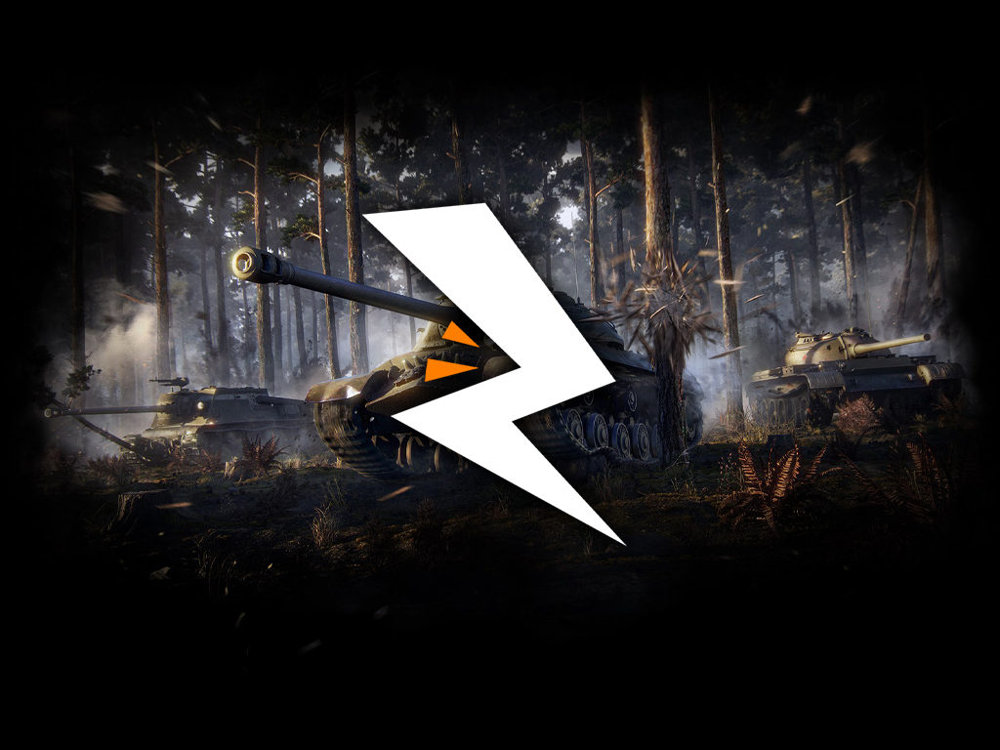

### Познакомьтесь с нашей командой!

Nikolay___49_0 (RUBY) - отвечает за интерфейсные модификации.  
Blitz_Druaccula (RUBY)  - помогает с интерфейсными модификациями.

---

### Сообщества, помогавшие с «Blitz Classic»

    

        

            

                <ul class="vehicles-list">
                    <li class="vehicles-list_item vehicles-list_item">
                        <a class="vehicles-list_link js-tooltip js-tooltip-id_js-premium_tooltip"
                            href="https://vk.com/modstech">
                            
                                
                            
                            ModsTech
                        </a>
                    </li>
                    <li class="vehicles-list_item">
                        <a class="vehicles-list_link" href="https://forblitz.ru/">
                            
                                
                            
                            ForBlitz
                        </a>
                    </li>
                    <li class="vehicles-list_item vehicles-list_item">
                        <a class="vehicles-list_link js-tooltip js-tooltip-id_js-premium_tooltip"
                            href="https://vk.com/tanksblitz7rat">
                            
                                
                            
                            7-RAT
                        </a>
                    </li>
                </ul>
            

        

    

 
